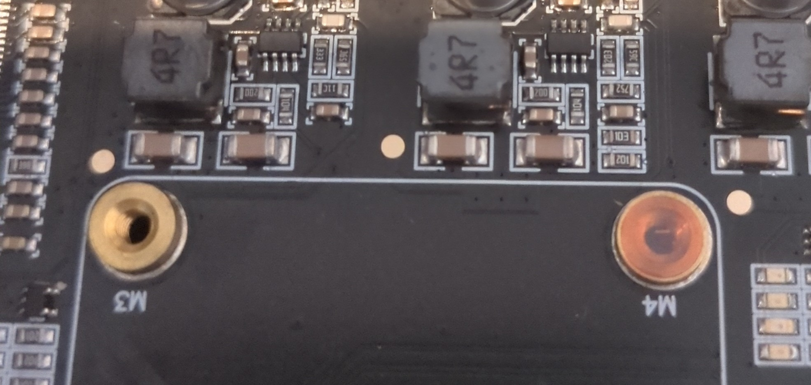

# Hardware setup

The instruction manuals for the DeskPi and case are pretty good, but I'll walk through the high level steps here with
some specific thoughts about the order to do things in for best results.

## Screw covers

Each of the holes to screw down the Compute Modules to hold them are covered with little stickers. There's no mention of
this in either of the official documentation and I missed this initially and had to remove all the compute modules late
in the process to remove them and rebuild everything. Do this first!

