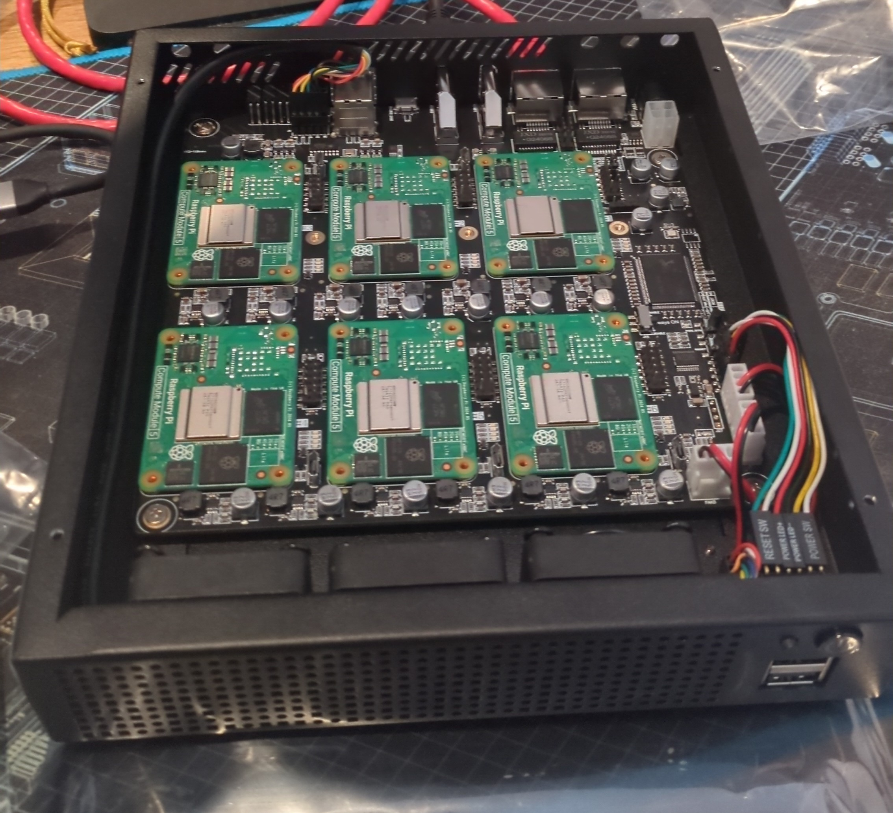

# Hardware setup

The instruction manuals for the DeskPi and case are pretty good, but I'll walk through the high level steps here with
some specific thoughts about the order to do things in for best results. Most tools you'll need are included, however I
would make sure you have a plastic spudger and pick. A spudger is especially important to make removing a compute module
easy if you need to do it.

## Screw covers

Each of the holes to screw down the Compute Modules to hold them are covered with little stickers. There's no mention of
this in either of the official documentation and I missed this initially and had to remove all the compute modules late
in the process to remove them and rebuild everything. Do this first! I had the best luck using a plastic pick to scrape
the sticker off.

## Install the modules on the DeskPi

The DeskPi only has support for USB devices and HDMI in the first slot. Your first module should go in this slot as most
operating system installations will require access to USB during the first boot. For MicroOS, you will need a USB device
to configure Combustion to configure the SD Card on first boot. For Raspberry Pi OS, you will need a monitor and
keyboard to walk through the installation. Before moving forward, you should make sure that an SSH daemon is running and
you can connect to it from another computer.

After one SD Card is configured, you can move it into a different slot, put a compute module into the same slot and it
should now boot using that configuration.

As I put each module in, I setup static DHCP for that module so that I could have a "static" IP address for each module
and match them to slots on the board to make things easy to match. For example, module #2 on the board maps to
`picluster2` as the hostname and `x.x.x.x2` as the IP address.

## Install everything in the case

Once all the modules are on the board, booting and you're able to connect to all the modules via SSH, you're ready to
install the board into the case. This is very straight forward if you follow the information in the manual. Once it's in
and everything from the case is plugged in, one last test is worth it before applying the heatsinks.

When installing the heatsinks, place the thermal pads of the appropriate size on, then tighten screws in an X pattern.

Once all the heatsinks are installed, boot things up one last time and make sure that everything is working before
closing the top of the case.

## Next

Next, we need to [install Kubernetes][kubernetes].

[kubernetes]: ./03-kubernetes.md
